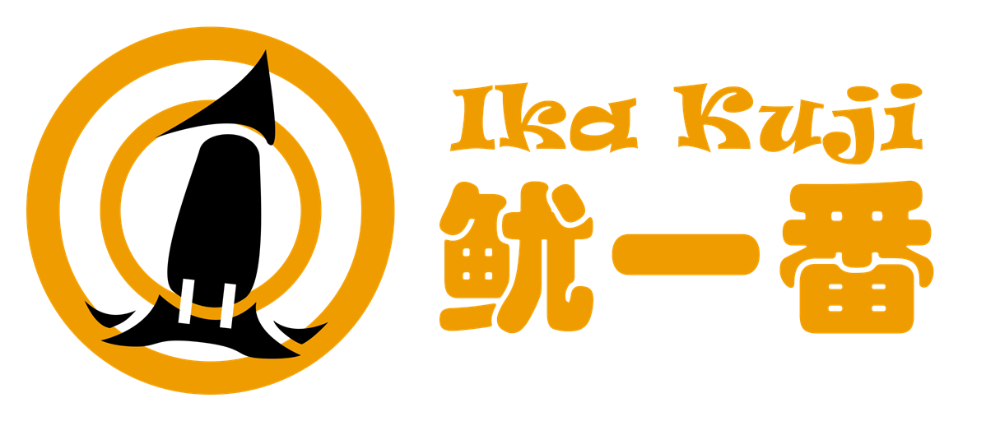

# 鱿一番（Ika Kuji）

_——“一番赏什么的抽不中的哟，我是不会上当的哟”_

**鱿一番** 是一款 Minecraft 一番赏抽奖服务端 mod，灵感来源于日本的一番赏活动，可以让玩家体验独特的抽奖功能。通过本 mod，玩家可以进行多次的、多轮的不重复抽奖，以赢取各种奖品。本 mod 更提供阶段性概率覆写、最终奖等独特功能配置

## 特性

- **服务器端独有**：本 mod 类似插件，无需客户端安装，仅需在服务器上安装即可游玩
- **不重复抽奖**：除了提供通常的抽奖插件功能外，还能够通过配置以让每次抽奖提供不同的物品
- **可定制**：可自定义奖品、权重等内容
- **国际化与本地化**：大部分文本均支持本地化

## 下载与安装

要下载并安装本 mod，请于本仓库的 [发行版](releases) 位置下载对应的版本，并将其放入 Minecraft 服务器的 `mods` 文件夹中

## 教程

有关详细的使用说明和配置选项，请参阅本仓库的 [Wiki](https://gitee.com/ancientsky/ika-kuji/wiki)

## 依赖

本 mod 基于 [EnvyAPI](https://github.com/EnvyWare/API) 进行开发，需要服务端安装 Forge。EnvyAPI 已被集成至 mod 中，无需额外安装

它支持以下的 Minecraft 版本：

- 1.12.2
- 1.16.5
- 1.20.2

## 支持与赞助

如果您觉得鱿一番有帮到您，并希望支持更多开发，请考虑赞助我们。有关赞助机会的更多信息，请查看 [这里](https://github.com/username/ika-kuji/sponsorship)
